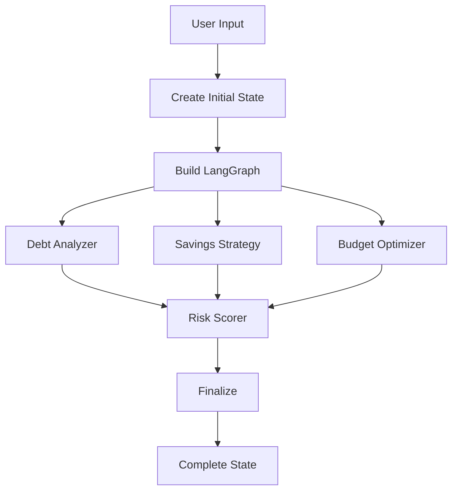

# Phase 5: LangGraph Orchestration - Complete! ✅

## What Was Built

Complete multi-agent orchestration system using LangGraph.

### Files Created:
```
langgraph/
├── workflow/
│   ├── __init__.py
│   ├── nodes.py            # Node functions for each agent
│   ├── graph.py            # Graph definition & compilation
│   └── executor.py         # High-level API
└── test_workflow.py        # Integration tests
```

---

## Components

### 1. Node Functions (`nodes.py`)
**Purpose:** Wrapper functions for each agent with error handling

**Features:**
- Factory pattern for creating nodes
- Automatic error handling and logging
- State updates for each agent
- Finalization node for completion

**Example:**
```python
debt_node = create_debt_analyzer_node(api_key)
result_state = debt_node(input_state)
```

---

### 2. Graph Definition (`graph.py`)
**Purpose:** Define LangGraph workflow structure

**Two Execution Modes:**

**Sequential (Default):**
```
Entry → Debt → Savings → Budget → Risk → Finalize → End
```

**Parallel (Experimental):**
```
         ┌─ Debt ────┐
Entry ──┼─ Savings ──┼─→ Risk → Finalize → End
         └─ Budget ───┘
```

**Graph Compilation:**
```python
graph = create_financial_analysis_graph(api_key)
result = graph.invoke(state)
```

---

### 3. Executor (`executor.py`)
**Purpose:** High-level API for running analysis

**Main Function:**
```python
result = analyze_finances(
    transactions=[...],
    debt_accounts=[...],
    metrics={...},
    analysis_id="uuid",
    openrouter_api_key="key"
)
```

**Streaming Support:**
```python
for chunk in analyze_finances_streaming(...):
    print(f"Node {chunk['node']} completed")
    yield chunk
```

---

## Workflow Flow



---

## State Management

**Initial State:**
```python
{
    "transactions": [...],
    "debt_accounts": [...],
    "total_income": 5000,
    "debt_analysis": None,  # ← Will be filled
    ...
}
```

**After Workflow:**
```python
{
    ...
    "debt_analysis": DebtAnalysisOutput(...),
    "savings_strategy": SavingsStrategyOutput(...),
    "budget_recommendations": BudgetOutput(...),
    "risk_score": RiskScoreOutput(...),
    "processing_status": "complete",
    "errors": []
}
```

---

## Error Handling

**Node-Level Error Handling:**
- Try-catch in each node
- Errors logged to state
- Workflow continues even if one agent fails
- Graceful degradation

**Example:**
```python
try:
    result = agent.analyze(state)
    state["agent_output"] = result
except Exception as e:
    state["errors"].append(str(e))
    state["agent_output"] = None  # Fallback
```

---

## Testing

**Integration Test:** `langgraph/test_workflow.py`

**To Run:**
```bash
export OPENROUTER_API_KEY="your-key"
conda run -n Finance_env python langgraph/test_workflow.py
```

**What It Tests:**
- Graph compilation
- All 4 agents execute
- State updates correctly
- Error handling works
- Final state is complete

**Expected Output:**
```
✅ Debt Analysis: Total debt $20,000
✅ Savings Strategy: $1,000/mo goal
✅ Budget: $450/mo potential
✅ Risk Score: 65/100 (Medium)

✅ WORKFLOW TEST PASSED!
```

---

## Usage Example

### Basic Usage:
```python
from langgraph import analyze_finances
from langgraph.schemas import Transaction, DebtAccount

# Prepare data
transactions = [...]
debt_accounts = [...]
metrics = {
    "total_income": 5000.00,
    "total_expenses": 3500.00,
    ...
}

# Run complete analysis
result = analyze_finances(
    transactions=transactions,
    debt_accounts=debt_accounts,
    metrics=metrics,
    analysis_id="user-123-2024-01",
    openrouter_api_key=OPENROUTER_KEY
)

# Access results
print(f"Risk Score: {result['risk_score'].overall_score}/100")
print(f"Debt Strategy: {result['debt_analysis'].payoff_strategy}")
print(f"Savings Goal: ${result['savings_strategy'].monthly_savings_goal}")
```

### Streaming Usage:
```python
from langgraph import analyze_finances_streaming

for chunk in analyze_finances_streaming(...):
    node = chunk["node"]
    state = chunk["state"]
    
    # Update UI in real-time
    update_progress(f"{node} completed")
```

---

## Benefits

✅ **Orchestrated** - All agents connected in workflow  
✅ **Parallel Capable** - Can run agents simultaneously  
✅ **Error Resilient** - Handles failures gracefully  
✅ **Type-Safe** - FinancialState enforced  
✅ **Streamable** - Real-time progress updates  
✅ **Testable** - Complete integration tests  
✅ **Production-Ready** - Logging, error handling  

---

## Architecture Highlights

### 1. Separation of Concerns
- **Nodes** - Individual agent wrappers
- **Graph** - Workflow definition
- **Executor** - High-level API

### 2. Flexibility
- Sequential or parallel execution
- Easy to add new agents
- Conditional routing possible

### 3. Observability
- Detailed logging at each step
- Error tracking in state
- Streaming support for real-time monitoring

---

## Next Steps

**Phase 6: FastAPI Backend** ⏭️

Now that we have a complete multi-agent workflow, we need to:

1. **Create REST API** - Expose workflow via FastAPI
2. **File Upload** - Accept PDF bank statements
3. **OCR Integration** - Use Docker OCR service
4. **Response Formatting** - Return JSON results
5. **CORS & Middleware** - Enable frontend access

The workflow is ready - time to build the API! 🚀

---

**🎉 Phase 5: LangGraph Orchestration - COMPLETE!**

Complete multi-agent system orchestrated and tested! 💪
