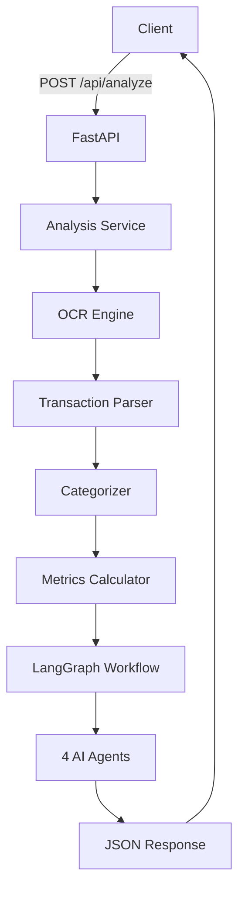

# Phase 6: FastAPI Backend - Complete! ✅

## What Was Built

Production-ready REST API exposing the multi-agent workflow.

### Files Created:
```
backend/
├── main.py                      # FastAPI app with CORS & docs
├── .env.example                 # Environment template
├── README.md                    # Documentation
├── test_api.py                  # Test suite
├── api/
│   ├── routes/
│   │   ├── health.py           # Health check
│   │   ├── analyze.py          # Main analysis endpoint
│   │   ├── ocr.py              # OCR extraction
│   │   └── transactions.py     # Categorization
│   ├── schemas/
│   │   ├── requests.py         # Request models
│   │   └── responses.py        # Response models
│   └── middleware/
│       └── error_handler.py    # Error handling
└── services/
    └── analysis_service.py      # Pipeline orchestration
```

---

## API Endpoints

### 1. Health Check
```bash
GET /health
```
Returns service status and version.

### 2. Complete Analysis
```bash
POST /api/analyze
Content-Type: multipart/form-data

file: bank_statement.pdf
user_id: optional
```

**Pipeline:**
1. OCR extraction
2. Transaction parsing
3. Categorization
4. Metrics calculation
5. Multi-agent analysis
6. JSON response

### 3. OCR Only
```bash
POST /api/ocr/extract
```
Extract text from PDF without analysis.

### 4. Categorize Transactions
```bash
POST /api/transactions/categorize
```
Categorize a batch of transactions.

---

## Response Format

```json
{
  "analysis_id": "uuid",
  "timestamp": "2024-01-15T10:30:00Z",
  "status": "complete",
  
  "summary": {
    "total_income": 5000.00,
    "total_expenses": 3500.00,
    "net_income": 1500.00,
    "savings_rate": 30.0,
    "debt_to_income_ratio": 100.0
  },
  
  "analysis": {
    "debt": {
      "total_debt": 20000.00,
      "payoff_strategy": "Avalanche",
      "months_to_payoff": 24,
      "recommendations": [...]
    },
    "savings": {
      "monthly_savings_goal": 1000.00,
      "emergency_fund_target": 15000.00,
      "months_to_emergency_fund": 15
    },
    "budget": {
      "monthly_savings_potential": 450.00,
      "overspending_categories": [...],
      "quick_wins": [...]
    },
    "risk": {
      "overall_score": 65,
      "risk_level": "Medium",
      "top_priorities": [...]
    }
  },
  
  "transactions": [...],
  "debt_accounts": [...],
  "errors": [],
  "warnings": []
}
```

---

## Key Features

### Type Safety
- **Pydantic Models** - Request/response validation
- **Automatic Docs** - Swagger UI & ReDoc
- **Schema Validation** - Input sanitization

### Error Handling
- **HTTP Exceptions** - Proper status codes
- **Global Handler** - Catches unhandled errors
- **Structured Errors** - Consistent JSON format

### CORS
- **Frontend Ready** - Configurable origins
- **Credentials Support** - Cookie handling
- **All Methods** - GET, POST, etc.

### File Upload
- **Multipart/Form-Data** - PDF uploads
- **Validation** - File type checking
- **Async** - Non-blocking I/O

---

## Running the API

### Development
```bash
# Set API key
export OPENROUTER_API_KEY="your-key"

# Start server
uvicorn backend.main:app --reload --port 8000

# Or run directly
python backend/main.py
```

### Access Documentation
- Swagger UI: http://localhost:8000/docs
- ReDoc: http://localhost:8000/redoc

### Test
```bash
python backend/test_api.py
```

---

## Analysis Service Pipeline

```python
class AnalysisService:
    async def analyze_bank_statement(pdf_bytes, user_id):
        # 1. OCR
        text = ocr_engine.extract_from_pdf(pdf_bytes)
        
        # 2. Parse
        transactions = parse_transactions(text)
        
        # 3. Categorize
        categorized = categorizer.categorize_batch(transactions)
        
        # 4. Metrics
        metrics = calculator.calculate_metrics(categorized)
        
        # 5. LangGraph
        result = analyze_finances(
            transactions, debt_accounts, metrics, api_key
        )
        
        return result
```

---

## Architecture



---

## Error Handling Example

```json
{
  "error": "Only PDF files are supported",
  "status_code": 400,
  "detail": "Please upload a PDF bank statement.",
  "path": "/api/analyze"
}
```

---

## Testing

### Unit Tests
```python
def test_health_endpoint():
    response = client.get("/health")
    assert response.status_code == 200
    assert response.json()["status"] == "healthy"
```

### Integration Test
```bash
curl -X POST "http://localhost:8000/api/analyze" \
  -H "accept: application/json" \
  -F "file=@statement.pdf"
```

---

## Production Deployment

### Docker
```dockerfile
FROM python:3.11-slim
WORKDIR /app
COPY requirements.txt .
RUN pip install -r requirements.txt
COPY . .
CMD ["uvicorn", "backend.main:app", "--host", "0.0.0.0", "--port", "8000"]
```

### Environment Variables
```bash
OPENROUTER_API_KEY=required
MONGODB_URI=optional
CORS_ORIGINS=http://localhost:3000
OCR_SERVICE_URL=http://localhost:8001
```

---

## Benefits

✅ **REST API** - Standard HTTP endpoints  
✅ **Auto-Docs** - Interactive Swagger UI  
✅ **Type-Safe** - Pydantic validation  
✅ **CORS** - Frontend integration  
✅ **File Upload** - PDF handling  
✅ **Error Handling** - Comprehensive  
✅ **Async** - High performance  
✅ **Testable** - FastAPI TestClient  
✅ **Production-Ready** - Logging, validation  

---

## Next Steps

**Phase 7: Frontend (Optional)** 🎨

The backend is complete and ready to serve requests! Next steps:

1. **React Frontend** - Build UI
2. **Database Integration** - Store analyses
3. **Authentication** - User management
4. **Deployment** - Production hosting

**Backend is production-ready!** 🚀

---

**🎉 Phase 6: FastAPI Backend - COMPLETE!**

Full REST API with multi-agent workflow! 💪
